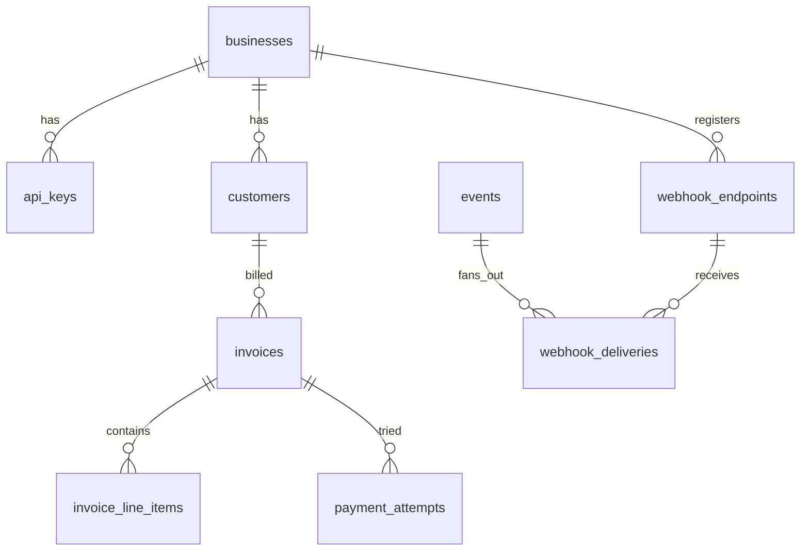
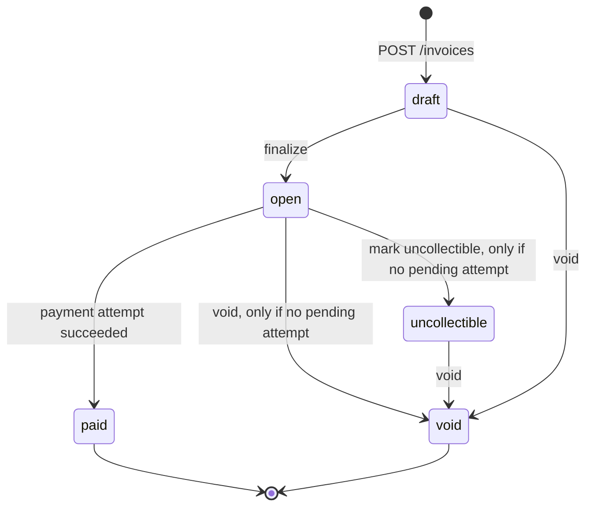
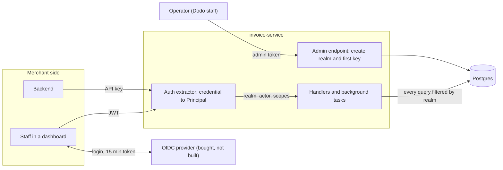

# DESIGN.md: Invoice & Payment Service

**Stack.** Rust (Axum, tokio), PostgreSQL 16 via sqlx (runtime queries, embedded migrations). Two binaries: `invoice-service` (API plus two background tasks) and `mock-psp`. No queue or cache: Postgres row locks, partial unique indexes and `SKIP LOCKED` cover everything this problem needs, and each extra component is another failure mode.

**Principles.** (1) Money is `i64` cents with checked arithmetic. (2) The database enforces invariants; application code is the fast path. (3) Never hold a lock across a network call. (4) An ambiguous PSP outcome is resolved by asking the PSP, never by guessing.

## 1. Data Model



| Table                | Notable shape                                                                 | Indexes / constraints                                                                                                                              |
| -------------------- | ----------------------------------------------------------------------------- | -------------------------------------------------------------------------------------------------------------------------------------------------- |
| `api_keys`           | `prefix`, `key_hash`, `revoked_at`                                            | `prefix` UNIQUE (lookup handle)                                                                                                                    |
| `customers`          | name, email, `business_id`                                                    | list index `(business_id, created_at DESC, id DESC)`; `UNIQUE (id, business_id)`                                                                   |
| `invoices`           | `state`, `total_cents`, `due_date`, `currency`                                | CHECK on state, `total_cents > 0`, `currency = 'USD'`; composite FK `(customer_id, business_id)`; `(business_id, state, created_at DESC, id DESC)` |
| `invoice_line_items` | description, quantity, `unit_amount_cents`, position                          | `UNIQUE (invoice_id, position)`                                                                                                                    |
| `payment_attempts`   | `status` pending/succeeded/failed, `psp_ref`, `failure_code`, amount snapshot | partial UNIQUE `(invoice_id) WHERE status='pending'`; partial UNIQUE `(invoice_id) WHERE status='succeeded'`                                       |
| `idempotency_keys`   | `request_hash`, `attempt_id`, stored response                                 | PK `(business_id, key)`                                                                                                                            |
| `events`             | outbox plus audit trail, JSON snapshot                                        | `(business_id, id)`                                                                                                                                |
| `webhook_deliveries` | status, `attempt_count`, `next_attempt_at`                                    | partial index on due rows; `UNIQUE (event_id, endpoint_id)`                                                                                        |

**Why this shape.** Line items are rows, not JSONB, so the total is recomputable and auditable. The composite FK makes cross-tenant references impossible even if a handler forgets a check. The two partial unique indexes mean the database refuses a second in-flight attempt or a second success, regardless of application bugs. The total is stored on the invoice and computed once by the server; line items are immutable, so the amount cannot change between check and charge.

**Primary keys.** UUIDv7 generated in the app: time-ordered (good index locality), non-enumerable. Rejected `bigserial` (leaks volume, enumerable) and UUIDv4 (random inserts fragment indexes).

**At 100x.** Partition `events` and `webhook_deliveries` by month and drop old partitions; purge idempotency keys at 24 h (not built yet, see section 7); add PgBouncer and read replicas for list endpoints; run the dispatcher and reconciler as separate processes (they already coordinate through `SKIP LOCKED`, so no schema change).

## 2. Invoice State Machine



- **Terminal:** `paid`, `void`. **Reversible:** none. Money states do not move backwards; a mistaken payment becomes a refund (out of scope).
- **Why these states:** `draft` is the pre-send state, `open` is the only payable state, `uncollectible` is an accounting write-off label.
- **Rejection:** one `can_transition(from, to)` function, then `UPDATE invoices SET state=$to WHERE id=$1 AND state=$from`. Zero rows means someone changed it first; we re-read and return 409 `invalid_state_transition` naming the current state.
- **Transition vs payment race:** `void` and `mark_uncollectible` lock the invoice row and refuse (409 `payment_in_progress`) while a pending attempt exists, because a charge may be in flight. Whoever takes the row lock first wins; the other sees the new state.
- **Deliberation:** I cut `uncollectible → paid` (late payment) to keep the graph small; it is listed in section 6.

## 3. Payment Correctness & Failure Modes

**Flow of `POST /invoices/{id}/pay` (requires `Idempotency-Key`):**

1. **Tx A (milliseconds):** claim the idempotency key (`INSERT ... ON CONFLICT DO NOTHING`), `SELECT ... FOR UPDATE` the invoice, require `state='open'`, insert a `pending` attempt. Commit, releasing the lock.
2. **PSP call, outside any transaction:** a spawned task calls `POST /charges` with `reference = attempt.id` and a 35 s deadline. The handler waits at most 5 s.
3. **Tx B (idempotent finalisation):** lock the invoice row first (same order as Tx A, so no deadlock), then `UPDATE payment_attempts SET status=... WHERE id=$1 AND status='pending'` (zero rows means already finalised, stop); on success `UPDATE invoices SET state='paid' WHERE state='open'`; insert the outbox event; store the idempotent response. Used by both the task and the reconciler.

**Concurrency mechanism:** row-level `FOR UPDATE` plus the partial unique index as a backstop. Over alternatives: advisory locks add a concept for the same effect; SERIALIZABLE needs retry loops; optimistic versioning needs retries and still needs the unique index. The lock lasts milliseconds because it is never held across the PSP call (holding it for 30 s would stall every request touching that row and exhaust the pool).

**(a) Two simultaneous pays.** One proceeds. The other blocks on the row lock, then either hits the unique index (409 `payment_in_progress`) or sees `paid` (409 `invoice_not_payable`). One PSP call in total.

**(b) PSP timeout (`tok_timeout`).** After 5 s the endpoint returns **202** with the attempt id. The attempt stays `pending`, the invoice stays `open`, and a second pay gets 409. The spawned task finalises when the PSP answers at about 30 s. The caller finds out via `GET /invoices/{id}`, `GET /invoices/{id}/payment_attempts`, or the `invoice.paid` webhook. A replay of the same key returns the live state while pending and the final stored response afterwards.

**(c) PSP succeeded, service crashed before persisting.** The attempt row was committed before the call, so it is `pending` on disk. The reconciler (every 15 s) looks up pending attempts older than 45 s with `GET /charges/{attempt.id}`; the PSP says `succeeded`; Tx B finalises. A client retry with the same key finds the pending attempt and never calls the PSP again, and even a duplicate PSP call is deduplicated because the PSP is idempotent on `reference`. No double charge.

**(d) Same key, different body.** `request_hash = sha256(method | path | canonical body)` is compared; mismatch returns 422 `idempotency_key_reuse` and nothing executes.

**(e) Pay on a `paid` invoice.** 409 `invoice_not_payable` naming the state, decided under the row lock. The same key replays the original 200.

**Ambiguous PSP answers.** A 5xx or a fast connection failure gets one immediate `GET /charges/{ref}`: a 404 means no charge exists, so the attempt becomes `failed` (`psp_unavailable`), the response is 502 and the invoice stays `open` for a retry with a new key (`tok_network_error`). A client-side **timeout gets no immediate verdict**: the attempt stays `pending` and the reconciler only concludes "no charge" after 2 minutes, because a slow request may still land at the PSP.

**Known residual risk.** If a delayed request reaches the PSP after we concluded "no charge", money moves without our record, and today nothing detects it (section 7). Real systems close this with a PSP-side cancel/void; I would add that first against a real PSP. If Tx B ever finds the invoice not `open` after a success, it logs an error and keeps the attempt `succeeded`, since the money did move.

## 4. Webhook Design

- **Events:** `invoice.created`, `invoice.finalized`, `invoice.voided`, `invoice.marked_uncollectible`, `invoice.paid`, `invoice.payment_failed`. The required three are `created`, `paid` and `payment_failed`.
- **Decoupling:** the API only inserts an `events` row and one `webhook_deliveries` row per enabled endpoint, in the same transaction as the state change (transactional outbox). Nothing is lost on a crash, and the response never waits on a customer's server. A tokio task delivers from the table.
- **Dispatcher:** polls every second, claims rows with `FOR UPDATE SKIP LOCKED` and sets `next_attempt_at = now() + 60 s` as a lease (a crashed worker's rows reappear), then delivers outside the transaction.
- **Signing:** header `Dodo-Signature: t=<unix>,v1=<hex>` where `v1 = HMAC_SHA256(endpoint_secret, t + "." + raw_body)`. Receivers recompute, compare in constant time and reject if `|now - t| > 300 s`. The timestamp is signed, so captured requests cannot be replayed or re-timestamped. **Each retry is re-signed with a fresh timestamp**, otherwise retries after 5 minutes would fail their own replay check.
- **Retries:** 8 attempts total. Delays before attempts 2 to 8: 10 s, 1 min, 5 min, 30 min, 2 h, 6 h, 12 h (about 20.6 h budget), ±20% jitter, 5 s timeout per request, 2xx is success, no redirects.
- **Delivery semantics:** at-least-once. `Dodo-Event-Id` lets receivers dedupe. Ordering is not guaranteed; payloads carry a state snapshot and `created_at`.
- **Exhausted budget:** delivery becomes `dead`; the event remains in `events`. Businesses reconcile with `GET /v1/events?after=<last_seen_id>` (caveat in section 7).

## 5. API Key Model

- **Generation:** `dodo_sk_<prefix8>_<secret32>`, base62, secret from the OS RNG (about 190 bits). Shown once.
- **Storage:** prefix in clear as a lookup handle; only `sha256(secret)` stored. SHA-256 rather than argon2/bcrypt because the secret is high-entropy random (brute force is infeasible) and slow hashes would add per-request latency and a CPU-exhaustion lever.
- **Transmission:** `Authorization: Bearer` over TLS, never in URLs, never logged. Verification is a prefix lookup plus a constant-time compare; an unknown prefix, a wrong secret and a revoked key all return the same 401.
- **Rotation / revocation:** several active keys per business; create the new key, check its `last_used_at`, revoke the old (`revoked_at`, effective on the next request).
- **Blast radius:** one business's data, nothing cross-tenant (every query filters by the `business_id` derived from the key). There are no scopes, so a leaked key can also pay and void.

## 6. What I Cut and Why

1. **Refunds and partial payments:** out of scope; would add a `refunds` table and a refunded amount.
2. **`uncollectible → paid`:** real billing allows late payment; cut to keep the state graph small.
3. **Draft editing:** no update endpoint, so line items are immutable and the amount cannot change under a payment.
4. **Webhook management and delivery visibility:** endpoints cannot be edited, disabled or deleted, there is no delivery-status API and no manual redelivery; the tables and `GET /v1/events` cover recovery.
5. **Scoped API keys:** a read-only key type would limit blast radius but needs a permission model I did not want to half-build; it is the first build step in section 8.
6. **OAuth and any auth beyond API keys:** out of scope. There is no staff login and no per-integration credentials, and the operator is one static admin token. Section 8 designs the realm model these would grow into and the order I would build it.

## 7. Production Readiness Gap

**Top three:**

1. **Observability:** metrics and alerts on pending-attempt age, webhook backlog and PSP latency; distributed tracing. A pending attempt that never resolves must page someone.
2. **Abuse and security controls:** rate limiting per business, not per key, since a key can mint more keys (section 8); SSRF protection on webhook URLs (resolve at delivery time, block private ranges, HTTPS only); webhook secrets and card tokens encrypted at rest; a PSP-side void.
3. **Audit log, dunning and reconciliation:** an immutable change log, collection flow for failed payments, refunds, and daily reconciliation against the real PSP's settlement report.

**Known gaps I found by attacking my own code and did not fix:**

- A charge that lands at the PSP after the attempt was marked `failed` is never noticed; the reconciler only looks at `pending` attempts.
- A `pending` attempt the PSP reports as `processing` forever blocks pay, void and write-off, and nothing alerts or escalates.
- `GET /v1/events` can skip an event: ids are assigned before commit, so a late commit can land behind a consumer's cursor. A per-business sequence or a lagged read with overlap fixes it.
- Idempotency keys are never purged (the 24 h purge in section 1 is a plan, not code), and `POST /customers` and `POST /invoices` take no idempotency key.
- Webhook endpoints per business, and the list endpoints, are unbounded.

## 8. Tenancy and Auth Beyond API Keys (Designed, Not Built)

OAuth and any auth beyond API keys are out of scope, so the service has one tenant concept (the business) and one credential type for tenants (the API key). This section is the model they grow into: staff login, scoped keys and per-integration credentials can be added later without touching invoice or payment code.

**One realm per merchant.** A realm is the isolation boundary: everything a merchant owns carries its id (child rows such as line items reach it through their parent), and no credential can see across it. Here a realm is a `businesses` row and its id is `business_id`; I kept that name instead of renaming it everywhere for a synonym. The customer, invoice and event list indexes all lead with `business_id`, so a query reads only its own realm's slice, however many customers other merchants have.

```text
operator (Dodo staff)    outside every realm. Today: ADMIN_TOKEN, which can only create a business
└── realm                one merchant company. Today: a businesses row, id = business_id
    ├── apps             the merchant's integrations (backend, website, mobile). Today: api_keys, ungrouped
    ├── users            the merchant's staff, who log in. Today: none
    └── customers        the merchant's payers: billing records, not logins. Today: customers
        └── invoices → payment attempts
```



- **One seam.** The extractor turns any credential into the same `Principal { realm_id, actor, scopes }` (today `AuthedBusiness`, holding the business id and key id). Handlers read only that, so a new login method changes the extractor, not the handlers.
- **The token proves who; the database says what.** Staff log in at the provider (authorization code flow with PKCE) and get a JWT that carries identity only (`sub`, `iss`, `aud`, `exp`; 15 minutes at most). Realm, role and a disabled flag come from our own `users` row on every request, so a demotion or disable applies on the next request, and an unknown user gets nothing.
- **Apps stay on API keys.** With one service there is no need for tokens that other services verify offline; the per-request key lookup is already paid and revokes instantly.
- **Bought, not built.** Passwords, MFA, password reset, social login and refresh-token rotation belong to the OIDC provider. An identity provider is a product of its own.

**Rules that hold as auth grows.**

1. **Realm comes from the verified credential**, never from the body, query or path (true today).
2. **Three fences, so one mistake does not leak a merchant:** the credential fixes the realm, every query filters by it, and composite foreign keys refuse cross-realm links (built for invoice to customer). Postgres row-level security would be a fourth, but it needs every query inside a transaction that sets the realm; not worth that cost now.
3. **Operator authority is not a role.** Platform powers sit outside realm roles, behind their own check, and no realm admin can grant them. True today: `AdminAuth` guards only `POST /admin/businesses`, and a tenant key cannot pass it.
4. **Machines never inherit a human's rights, and delegation only narrows.** An app's scopes belong to the app; the person who created it is kept for audit only. A credential can create another only with scopes it already holds (today any key can mint a full-power key).
5. **Limits attach to the realm, not the key.** A key can mint more keys, so a per-key limit is easy to get around.

**Build order** (each step is additive; invoice and payment code stay unchanged):

1. **Scopes on API keys** (`invoices:read`, `invoices:write`, `payments:write`, `webhooks:write`, `keys:write`) plus the narrowing rule. This closes the section 5 gap: a leaked key can pay, void and mint more keys. Existing keys migrate with every scope.
2. **`apps` table** grouping keys and webhook endpoints per integration, so keys, limits and audit are per app.
3. **`users` and OIDC login** for staff, with fixed roles in code (admin, finance, read-only) that map to the same scopes.

**Rejected.**

- **Schema or database per realm:** strongest isolation, but migrations and connection pools multiply with the number of merchants. Wrong for thousands of small merchants; the right move for one enterprise merchant who demands it.
- **One provider realm per merchant:** fine for hundreds, then provisioning and admin work dominate. One provider pool plus `users.realm_id` in our database keeps membership under our control. A person at two merchants is two users for now; a `memberships` table fixes that if it is needed.
- **Roles as JWT claims, and custom roles per realm:** claims suit many services verifying tokens offline, and here they would go stale for up to 15 minutes. A role editor is a product feature, not a safety requirement.
